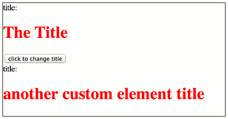
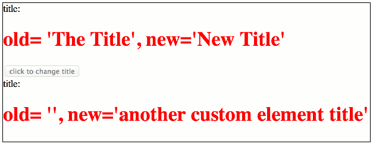
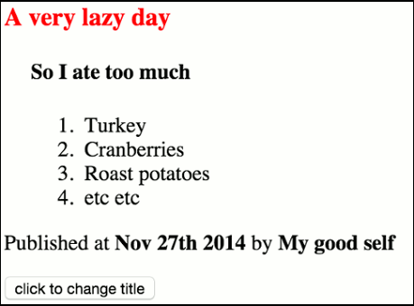

# delite - creating custom components

## delite background
delite is a new JavaScript library born out of the [Dojo Toolkit Dijit framework](http://dojotoolkit.org/reference-guide/1.10/dijit).
This isn't a replacement per se but a repository to be used as the core building blocks for leveraging current and future standards
in HTML, CSS & JavaScript to build reusable Web Components.

It can be used on it's own but more likely used with other projects either from the [ibm-js repositories](https://github.com/ibm-js)
or other repositories.

More information can be found on the [delite website](http://ibm-js.github.io/delite/) explaining the standards this library aims to conform to.

## Tutorial details
In this tutorial you'll learn how to create your own custom elements, learn how to register them, learn how to use templates
& learn how you can bind data. It's a beginner tutorial so we won't be delving too deep into what delite provides (yet!!!)

## Getting started
To quickly get started, we're using [https://github.com/ibm-js/generator-delite-element](https://github.com/ibm-js/generator-delite-element)
to install the required dependencies and create a basic scaffold.
These steps are already explained but we'll repeat that documentation using Yeoman to get started.

### create the scaffold

We'll let the `generator-delite-element` Yeoman generator do a basic setup for us which will quickly get us going.
(Start off with a simple custom element, no templating etc)

Install the `generator-delite-element` globally

    npm install -g generator-delite-element

And create a new directory (named `custom`, which will also be our package name) and change directory to it using the command :

    mkdir -p custom
    cd custom

Run Yeoman to create our scaffold

    yo delite-element

You'll be prompted to enter the widget package name & the name of the custom widget element, accept the defaults for delite widget element package
& delite widget element name, select no for the rest of the options.

    ? What is the name of your delite widget element package? (custom)
    ? What do you want to call your delite widget element (must contain a dash)? (custom-element)
    ? Would you like your delite element to be built on a template? n
    ? Would you like your delite element to providing theming capabilities? n
    ? Will your delite element require string internationalization? n
    ? Will your delite element require pointer management? n
    ? Do you want to use build version of delite package (instead of source version)? n

### A look through what's been generated
Lets look through what Yeoman created, again this is just a boilerplate setup but here's the important parts.

We've created a new package named `custom` for new widgets that we'll create.

- `./CustomElement.js` - this is our widget module
- `./CustomElement/css/CustomElement.css` - this is our widget css
- `./samples/CustomElement.html` - this is a sample how to use our new widget

This is the most basic setup for a widget/custom component, you can view the sample generated HTML `./samples/CustomElement.html`
in a browser to see what's been created.
We'll build upon this example HTML as we progress in the tutorial.

Note that we just accepted the default names the `yo` generator created for us. In case there's any confusion, the module name created `CustomElement` bears
no relation to the custom element name i.e. `custom-element`.

    blurb about using dcl here? i.e. using requirejs we include dcl and delite/register which allows us to create a class
    via a module. It needs to be explained briefly but hint that you could do it inline in the page, not using a module.

---

## Creating a custom element
Viewing the `./samples/CustomElement.html` example HTML we can see we've (partly) created the custom element declaratively in markup via
```html
<custom-element id="element" value="The Title"></custom-element>
```
For those who used the Dojo Toolkit Dijit framework previously, an important conceptual difference in delite is that the widget is the DOM node.
Dijit widgets instead, had a property which referenced the DOM node.

###Registering

The `<custom-element>` element doesn't constitute a custom element on it's own, it first needs to go through a registration process which is achieved using
the `delite/register` module. This is analogous to the HTML specification for registering custom elements
i.e. `document.registerElement('custom-element');`

If we look at the custom element module `./CustomElement.js` we see we register the custom element tag via:
```js
return register("custom-element", [HTMLElement, Widget], { .....
```

This is an important concept which sometimes isn't clear at a first glance. You can add any non-standard tag to an HTML page and the browser HTML parser
will not complain, this is because these elements will be defined as a native
[`HTMLUnknownElement`](http://www.whatwg.org/specs/web-apps/current-work/multipage/dom.html#htmlunknownelement).
To create a custom element it must be **upgraded** first, this is what `delite/register` does. `delite/register` supports browsers who natively
support `document.registerElement` and those who don't.

The registration process above using `delite/register`, creates a custom element by registering the tag name `"custom-element"` as the first
argument and then inheriting (prototyping) the `HTMLElement` native element (as well as the `"delite/Widget"` module).

Elements which inherit from `HTMLElement`
using [valid custom element names](http://www.w3.org/TR/2013/WD-custom-elements-20130514/#dfn-custom-element-name) are custom elements.
The most basic requirement for the tag name is it **MUST** contain a dash **(-)**.

###Declarative creation of custom elements
If we view the generated sample HTML `./samples/CustomElement.html`, we see the following code:

```js
require(["delite/register", "custom/CustomElement"], function (register) {
    register.parse();
});
```

Declarative widgets (those created via markup in the page) need to be parsed in order to kick off the lifecycle of creating the widget.

###Programmatic creation of custom elements
The generated example in `./samples/CustomElement.html` shows the declarative creation of custom elements, you can do the same thing
with programmatic creation

edit `./samples/CustomElement.html` i.e.

```js
require(["delite/register", "custom/CustomElement"], function (register) {
    register.parse();
});
```

to the following:
```js
require(["delite/register", "custom/CustomElement"], function (register, CustomElement) {
    register.parse();
    var anotherCustomElement = new CustomElement({value : 'another custom element title'});
    // note you must call startup() for programmatically created widgets
    anotherCustomElement.placeAt(document.body, 'last');
    anotherCustomElement.startup();
});
```

Note that programmatically created widgets should always call `startup()`. A helper function is provided for `delite/Widget` to place it
somewhere in the DOM named `placeAt`
(see the [documentation](https://github.com/ibm-js/delite/blob/master/docs/Widget.md#placement) for it's usage).
We need to also require the module for the custom element i.e. `"custom/CustomElement"` because we need to create a new instance and then call it's methods.


The above would render: (default image width 460x242)



**TODO: then go on to explain what prototyping `"delite/Widget"` does i.e. lifecycle methods**

###A look at the widget lifecycle methods for our simple widget
If we look at `"custom/CustomElement"` we can see two methods have been created for us, `render` and `refreshRendering`.
`render` is the most simplest of [lifecycle](https://github.com/ibm-js/delite/blob/master/docs/Widget.md#lifecycle)
methods we need to create our widget.

#### `render`
We normally wouldn't need to create a `render` method, typically we'd use templates to create our widget UI (which will be explained
later on) but because we aren't currently using a template we need to implement `render` to construct the widget UI for us. <br>
In our sample `render` method we're adding `<span>title</span>` and `<h1></h1>` elements to our widget as well as assigning a property
to the widget named `_h1` i.e. via `this.appendChild(this._h = this.ownerDocument.createElement("h1"));` which we can use to update
it programmatically or declaratively.


#### `refreshRendering`
`refreshRendering` is also a lifecycle method but implemented in `decor/Invalidating` which `delite/Widget` inherits from.
It's primary concern is to observe changes to properties defined on the widget and update the UI. In your web browser developer tools, if
you place a breakpoint in that method and then click the "click to change title" button, you'll see this method is called
(because the button adds inline JavaScript to update the element's value property).

If we wanted to see what the old value was (and also print it out to the DOM) we can change this method to the following:

```js
refreshRendering: function (props) {
    // if the value change update the display
    if ("value" in props) {
        this._h.innerText = "old= '" + props["value"] + "', new='" + this.value + "'";
    }
}
```

Notice when you first load the page, this method will be called for each widget & if you debug this method when you reload the page
you'll see that the `value` property of our widget is contained in the `props` argument. This is because we're setting the `value` property
on the declarative widget to `value="The Title"` and setting the value property on the programmatic widget to `value : "another custom element title"`.
If you don't set the `value` property of the widget at construction time, the `value` property of our widget is NOT contained in the `props` argument.

Click the 'click to change title button' which will render like:



If you still have a breakpoint set in `refreshRendering` you will see again that the `value` property of our widget is again contained in the `props`
argument.

Also, if you update the value `property` of `./CustomeElement.js` to:

```js
value: "The Title",
```

You'd notice again the `value` property of our widget is NOT contained in the `props` argument. This is because the property value hasn't changed.
The [decor/Invalidating](https://github.com/ibm-js/decor/blob/master/docs/Invalidating.md) documentation explains this behaviour.

###CSS

If we look at the `./CustomeElement.js` custom element module, we see there's a property defined named `baseClass` i.e. `baseClass: "custom-element"`.
This adds a class name to the root node of our custom element (which you can see in the DOM using your debugger tools). Also notice we include
in the `define` the `requirejs-dplugins/css!` plugin to load our css i.e. `"requirejs-dplugins/css!./CustomElement/css/CustomElement.css"`.
This plugin is obviously used to load CSS for our custom element. There's nothing much to say here apart from this is how you individually style
your components and [TODO] also at build time i.e. compiling `less` files, you won't load these files individually.


## Lifecycle methods for our simple widget (expand on later when using template or do this here?)
Explain the main lifecycle methods
```js
this.preCreate();
this.render();
this.postCreate();
```
##Templates
What we've done so far is obviously a very rudimentary demonstration. We wouldn't expect to programmatically create DOM nodes & this is where
delite comes into it's own. Out of the box, delite supports templates using an in built implementation of [Handlebars](http://handlebarsjs.com/).
We won't need to programmatically create DOM nodes in `render`, creating a template will do all the work for us.

Note there are some limitations using the `delite/handlebars!` plugin in delite for templating, namely it doesn't support iterators or conditionals
however in many cases this isn't a limiting factor. Support for this will be explained in a later more advanced tutorial when we discuss
[Liaison](https://github.com/ibm-js/liaison). The handlebars template implementation delite uses is primarily focused on performance.

We'll create a new delite custom element using Yeoman again.

Create a new directory somewhere (named `custom-templated`, which will also be our package name) and change directory to it using the command :

    mkdir -p custom-templated
    cd custom-templated

Run Yeoman again to create our scaffold

    yo delite-element

You'll be prompted to enter the widget package name & the name of the custom widget element, accept the defaults for delite widget element package
& delite widget element name, select Yes for the template option and no for the rest.

    ? What is the name of your delite widget element package? (custom-templated)
    ? What do you want to call your delite widget element (must contain a dash)? (custom-templated-element)
    ? Would you like your delite element to be built on a template? Y
    ? Would you like your delite element to providing theming capabilities? N
    ? Will your delite element require string internationalization? N
    ? Will your delite element require pointer management? N
    ? Do you want to use build version of delite package (instead of source version)? N


This, as shown in the console output, creates:

- `./CustomTemplatedElement.js` - this is our widget module
- `./CustomTemplatedElement/css/CustomTemplatedElement.css` - this is our widget css
- `./CustomTemplatedElement/CustomTemplatedElement.html` - this is our widget template
- `./samples/CustomTemplatedElement.html` - this is a sample how to use our new widget


###Handlebars
If we look at the template we just created `./CustomTemplatedElement/CustomTemplatedElement.html` we can see it's created the following:

```html
<template>
    title:
    <h1>{{value}}</h1>
</template>
```

All templates must be enclosed in a `<template>` element, we can see all the work we did in the `render` lifecycle method becomes much
more simple because now we're just dealing with HTML.

We don't need to implement the code in `render` of the non-templated example e.g. See our `./CustomElement.js` widget module in the previous example.
Instead we have:

```js

define([
	"delite/register",
	"delite/Widget",
	"delite/handlebars!./CustomTemplatedElement/CustomTemplatedElement.html",
    "requirejs-dplugins/css!./CustomTemplatedElement/css/CustomTemplatedElement.css"
], function (register, Widget, template) {
	return register("custom-templated-element", [HTMLElement, Widget], {
		baseClass: "custom-templated-element",
		value: "",
		template: template
	});
});

```

We just need to include the template using the handlebars plugin i.e.
`"delite/handlebars!./CustomTemplatedElement/CustomTemplatedElement.html"` and assign the resolved template to the `template` property of our widget i.e. `template: template`.

####Using handlebars templates
What we've done so far isn't very exciting, so lets try and do something more 'real life'. Imagine we need to implement blogging widgets.
The widget needs to show the blog title (which we've already done with `{{value}}`, a date it was published, the author and the content of the
blog.

Let's make some changes:
#####Template
Change our template to add new properties for a blog author, when the blog was published and the text of the blog
in `./CustomTemplatedElement/CustomTemplatedElement.html`:
```html
<template>
    <article>
        <h3>{{value}}</h3>
        <p class='blogdetails'>Published at <span>{{publishDate}}</span> by <span>{{author}}</span></p>
        <div class='blog'>{{articleContent}}</div>
    </article>
</template>
```
#####Widget
So we've added some new properties, which you see is very easy to do, all we need to do now is map those properties in the widget :

```js
define([
	"delite/register",
	"delite/Widget",
	"delite/handlebars!./CustomTemplatedElement/CustomTemplatedElement.html",
    "requirejs-dplugins/css!./CustomTemplatedElement/css/CustomTemplatedElement.css"
], function (register, Widget, template) {
	return register("custom-templated-element", [HTMLElement, Widget], {
		baseClass: "custom-templated-element",
		value: "",
		publishDate: new Date().toString(),
		author: "",
		articleContent : "",
		template: template
	});
});

```

Note that I've added a default value for `publishDate`, just in case setting a date was optional.

#####Sample usage
So now if you change the content of `./samples/CustomTemplatedElement.html` to the following:

```html
<custom-templated-element id="element" value="A very lazy day" publishDate="Nov 27th 2014" author="My good self" articleContent="Not doing much today because I've ate too much turkey."></custom-templated-element>
<button onclick="element.value='Now sleeping!'; event.target.disabled=true">click to change title</button>
```

And updating the template CSS `./CustomTemplatedElement/css/CustomTemplatedElement.css` to make it slightly more interesting to:

```css
/* style for the custom element itself */
.custom-templated-element {
    display: block;
}
.custom-templated-element h3 {
    color: red;
}
.custom-templated-element p.blogdetails span {
    font-weight: bold;
}
.custom-templated-element div.blog {
    padding-left: 20px;
}
```

If you refresh the page you'll see it's becoming something more you'd envisage as a widget we may want to write.

####delite/Container and containerNode
Now is a good time to discuss the functionality provided by [delite/Container](https://github.com/ibm-js/delite/blob/master/docs/Container.md).
Looking at the widget we've already created, the `articleContent` property of our widget might be seen as something which could be used to add arbitrary HTML
e.g. paragraph tags, list tags etc etc. If you try and add HTML content to the `articleContent` attribute of our sample `./samples/CustomTemplatedElement.html`
you'll see that any HTML tags added in the attribute value are escaped and not rendered as HTML; this is expected. Try it out e.g.

```html
<custom-templated-element id="element" value="A very lazy day" publishDate="Nov 27th 2014" author="My good self" articleContent="<b>my HTML tags are escaped</b>"></custom-templated-element>
<button onclick="element.value='Now sleeping!'; event.target.disabled=true">click to change title</button>
```

As explained in the `Container` documentation, it's to be used as a base class for widgets which contain other widgets. However it's also useful for our
intentions where we want to add arbitrary HTML for the `articleContent`.

#####Widget
Lets update our widget to use this:

```js
define([
	"delite/register",
	"delite/Widget",
	"delite/Container",
	"delite/handlebars!./CustomTemplatedElement/CustomTemplatedElement.html",
    "requirejs-dplugins/css!./CustomTemplatedElement/css/CustomTemplatedElement.css"
], function (register, Widget, Container, template) {
	return register("custom-templated-element", [HTMLElement, Widget, Container], {
		baseClass: "custom-templated-element",
		value: "",
		publishDate: new Date().toString(),
		author: "",
		template: template
	});
});

```

We've extended our widget using `delite/Container` (also removing the `articleContent` property which we don't need anymore).

#####Widget template
Update ./CustomTemplatedElement/CustomTemplatedElement.html` to the following:

```html
<template>
    <article>
        <h3>{{value}}</h3>
        <div class='blog' attach-point="containerNode"></div>
        <p class='blogdetails'>Published at <span>{{publishDate}}</span> by <span>{{author}}</span></p>
    </article>
</template>
```

Notice the `attach-point="containerNode"` attribute. This is a special 'pointer' to a DOM node which is used by `delite/Container`. When you inherit from
`delite/Container`, it adds a property to our widget named `containerNode` and this maps to any HTML (or widgets) as children of our widget.

#####Sample usage
Change the content of `./samples/CustomTemplatedElement.html` to the following:

```html
<custom-templated-element id="element" value="A very lazy day" publishDate="Nov 27th 2014" author="My good self">
    <h4>So I ate too much</h4>
    <ol>
        <li>Turkey</li>
        <li>Cranberries</li>
        <li>Roast potatoes</li>
        <li>etc etc</li>
    </ol>
</custom-templated-element>
<button onclick="element.value='Now sleeping!'; event.target.disabled=true">click to change title</button>
```

If you refresh your page now you should see something like the following:



TODO: recapture image, looks bad

You can see that the `attach-point="containerNode"` reference we created will render our declarative content wherever we've placed it in the template.
If you open up your developer tools and in the console enter:

```js
document.getElementById('element').containerNode.innerHTML = "<i>And now we've replaced our containerNode content</i>"
```

You'll see that our widget containerNode `innerHTML` is updated to what we've added.

TODO: GOT TO HERE


## topics
custom element
registering
templating (handlebars simple)

