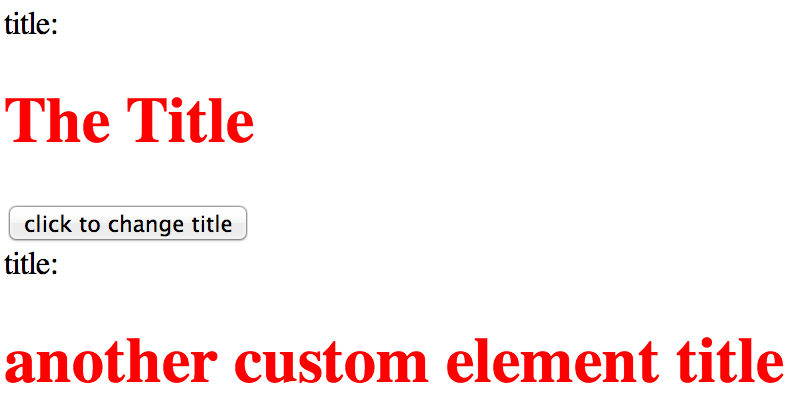

# delite - creating custom components

## delite background
delite is a new JavaScript library born out of the [Dojo Toolkit Dijit framework](http://dojotoolkit.org/reference-guide/1.10/dijit).
This isn't a replacement per se but a repository to be used as the core building blocks for leveraging current and future standards
in HTML, CSS & JavaScript to build reusable Web Components.

It can be used on it's own but more likely used with other projects either from the [ibm-js repositories](https://github.com/ibm-js)
or others repositories.

More information can be found on the [delite website](http://ibm-js.github.io/delite/) explaining the standards this library aims to conform to.

## Tutorial details
**TODO maybe this could be multi-step, not sure how much should be in this tut yet**

In this tutorial you'll learn how to create your own custom elements, learn how to register them, learn how to use templates
& learn how you can bind data.

## Getting started
To quickly get started, we're using [https://github.com/ibm-js/generator-delite-element](https://github.com/ibm-js/generator-delite-element)
to install the required dependencies and create a basic **TODO** scaffold.
These steps are already explained but **TODO** we'll repeat that documentation using Yeoman to get started.

---

**TODO: setup to be reviewed**

### create the scaffold

We'll let the `generator-delite-element` Yeoman generator do a basic setup for us which will quickly get us going.
(Start off with a simple custom element, no templating etc)

Install the `generator-delite-element` globally

    npm install -g generator-delite-element

And create a new directory (named my-element) and change directory to it

    mkdir -p first-delite-package  && cd $_

Run Yeoman to create our scaffold

    yo delite-element

You'll be prompted to enter the widget package name & the name of the custom widget element, accept the defaults for delite widget element package
& delite widget element name, select no for the rest of the options.

    [?] What is the name of your delite widget element package? first-delite-package
    [?] What do you want to call your delite widget element (must contain a dash)? my-first-element
    [?] Would you like your delite element to be built on a template? N
    [?] Would you like your delite element to providing theming capabilities? N
    [?] Will your delite element require string internationalization? N
    [?] Will your delite element require pointer management? N

### A look through what's been generated
Lets look through what Yeoman created, again this is just a boilerplate setup but here's the important components.

We've created a new package named `first-delite-package` for new custom elements that we'll create.

- `./MyFirstElement.js` - this is our custom element class
- `./MyFirstElement/css/MyFirstElement.css` - this is our custom element css
- `./samples/MyFirstElement.html` - this is a sample how to use our new custom element

This is the most basic setup for a custom component, you can view the sample generated HTML in a browser to see what's been created.
We'll build upon this example HTML as we progress in the tutorial.

Expand upon these resources & then add templating, then theming, internationalisation and pointer management

---

## Custom element
Viewing the `./samples/MyFirstElement.html` example HTML we can see we've created the custom element in markup via

    <my-first-element id="element" value="The Title"></my-first-element>

###Registering

`<my-first-element/>` doesn't constitute a custom element on it's own, it first needs to go through a registration process which is achieved using
the `delite/register` module. This is analogous to the HTML specification for registering elements i.e. `document.registerElement('my-first-element');`

If we look at the custom element class `./MyFirstElement.js` we see we register the custom element tag via:

    return register("my-first-element", [HTMLElement, Widget, Invalidating], { .....
This is an important concept which sometimes isn't clear at a first glance. You can add any non-standard tag to an HTML page and the HTML parser
will not complain, this is because these elements will be defined as an
[`HTMLUnknownElement`](http://www.whatwg.org/specs/web-apps/current-work/multipage/dom.html#htmlunknownelement).
To create a custom element it must be `upgraded` first, this is what `delite/register` does. `delite/register` supports browsers who natively
support `document.registerElement` and those who don't.

The registration process above using `delite/register`, creates a custom element by registering the tag name `my-first-element` as the first
argument and then inheriting (prototyping) the `HTMLElement` (as well as `"delite/Widget"` and `"decor/Invalidating"`).

Elements which inherit from `HTMLElement`
using [valid custom element names](http://www.w3.org/TR/2013/WD-custom-elements-20130514/#dfn-custom-element-name) are custom elements.
The most basic requirement for the tag name is it **MUST** contain a dash **(-)**.

###Programatic creation
The generated example in `./samples/MyFirstElement.html` shows the declarative creation of custom elements, you can do the same thing
with programmatic creation

edit `./samples/MyFirstElement.html` i.e.

    require(["delite/register", "first-delite-package/MyFirstElement"], function (register) {
    	register.parse();
    });
to the following:

    require(["delite/register", "first-delite-package/MyFirstElement"], function (register, MyFirstElement) {
        register.parse();
        var anotherCustomElement = new MyFirstElement({value : 'another custom element title'});
        anotherCustomElement.placeAt(document.body, 'last');
    }

Which would render:

**TODO: then go on to explain what prototyping `"delite/Widget"` does i.e. lifecycle methods**

## Lifecycle
Explain the main lifecycle methods

	this.preCreate();
	this.buildRendering();
	this.postCreate();

## topics
custom element
registering
templating (handlebars simple)

